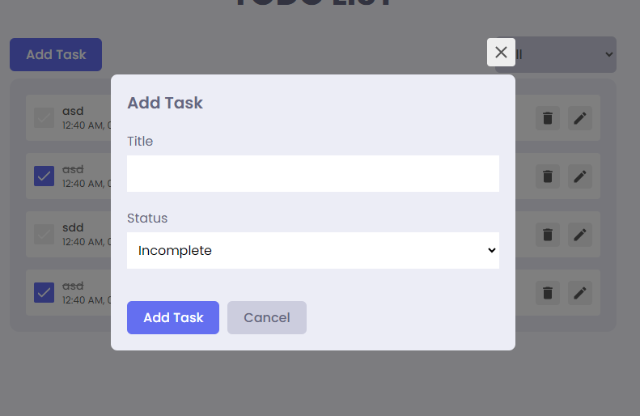

# React Todo App.
## Getting Started

```shell
npm install
```

and after that start the dev server.

```shell
npm start
```
# Contributing
Contributions are welcome! submit a pull request.
Setup to Create a Pull Request
To contribute to this project, follow these steps:

Fork this repository by clicking on the 'Fork' button at the top right corner of this page.

Clone your forked repository to your local machine:
```shell
git clone https://github.com/umairmanzoor1143/test.git
```
Create a new branch for your changes:
```shell
git checkout -b feature/my-changes
```
Make your desired changes to the codebase.
Stage and commit your changes:
```shell
git add .
git commit -m "Add your commit message here"
```
Push your changes to your forked repository:
```shell
git push origin feature/my-changes
```
Go to your forked repository on GitHub and click on the 'New pull request' button.

Provide a brief description of your changes and create the pull request.
